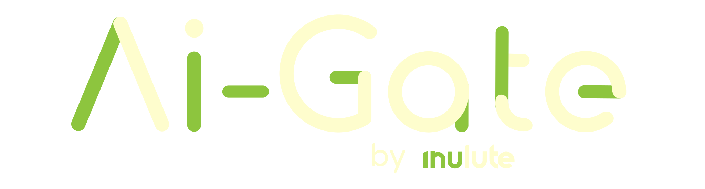
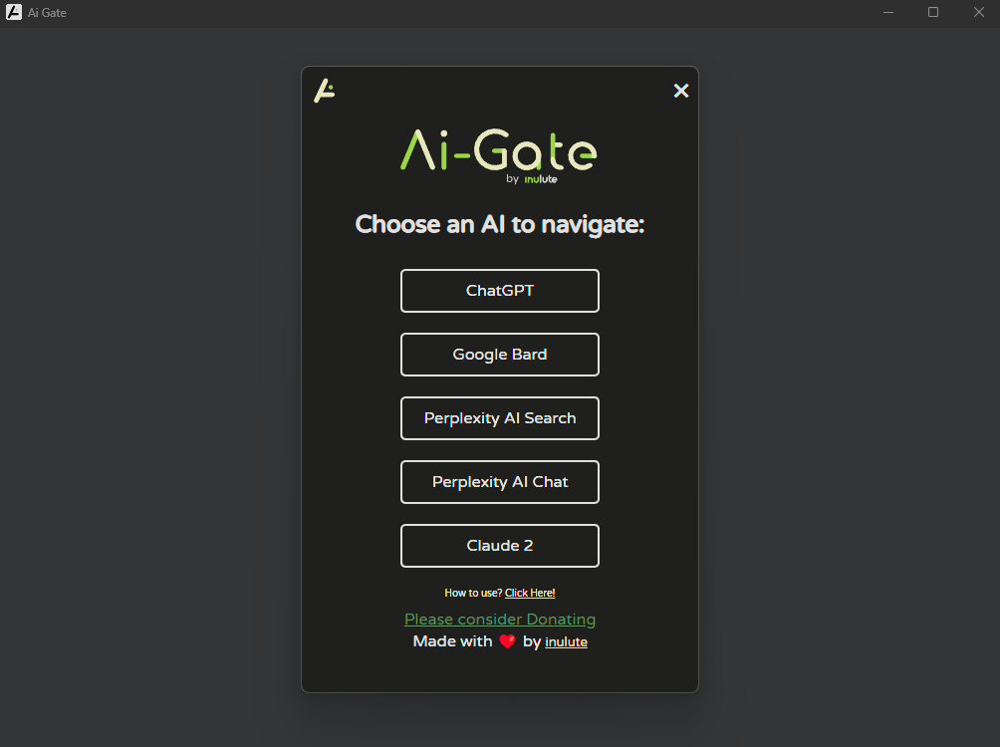
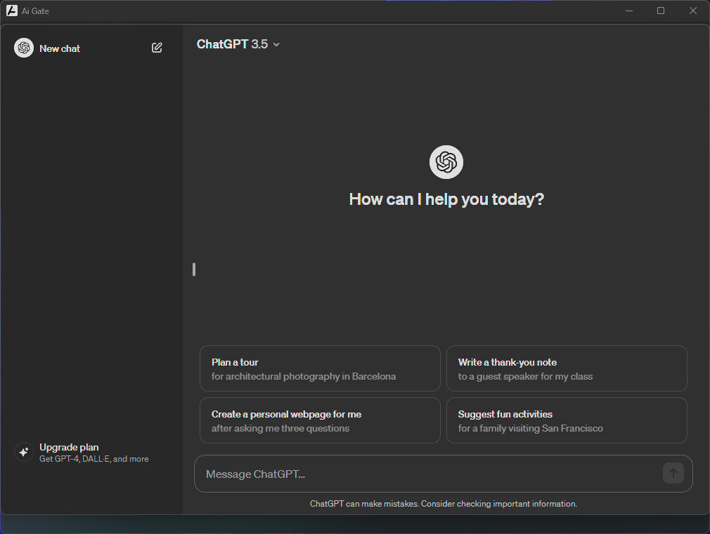
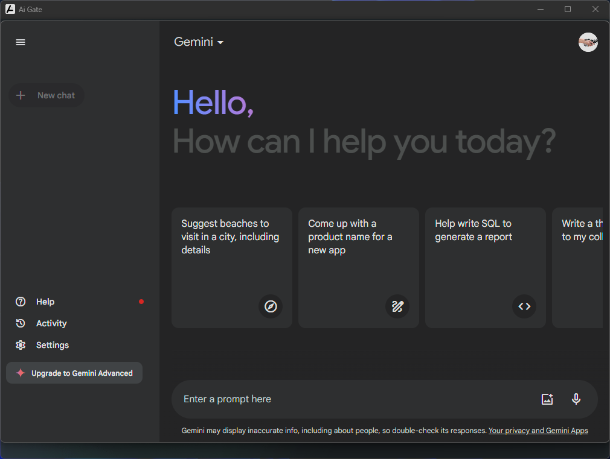
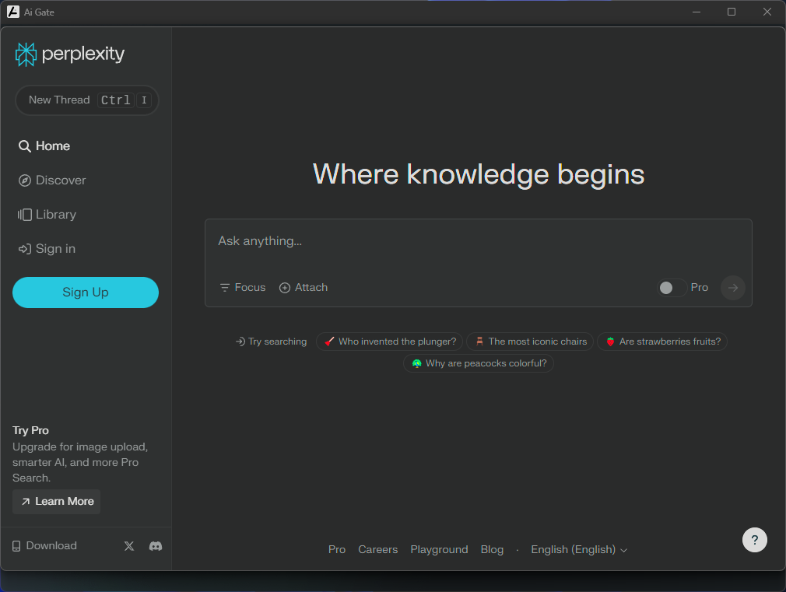
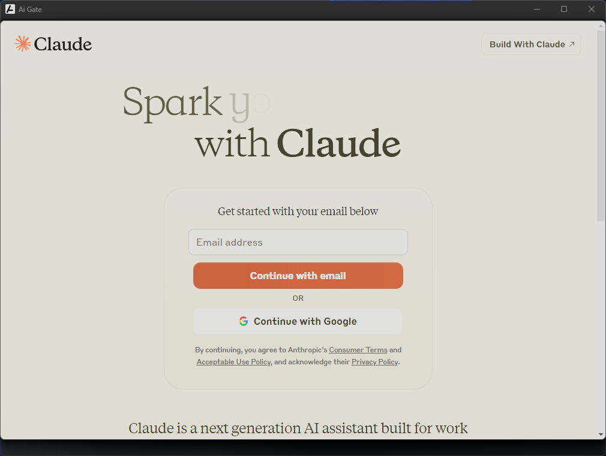
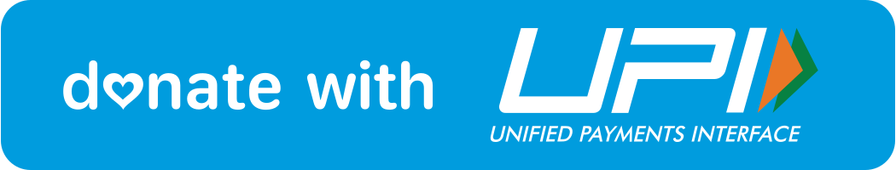

  

---

From AI Gate, you can access ChatGPT, Gemini, Perplexity, Claude all from one easy-to-use app. 🖥️

  

## Features

- **AI Tool Collection:** Access a curated selection of cutting-edge AI tools in one place. 🧰
- **User-Friendly Interface:** Intuitive and visually appealing interface for seamless interactions. 🎨
- **Fast and Efficient:** Instantly harness the power of AI without any delays or complications. ⚡
- **Cross-Platform Compatibility:** Available for Windows, Linux and macOS. 🖥️
- **Shortcuts to Switch AI's instantly:** You can switch AI tools using shortcuts. [Learn More about shortcuts.](https://aigate.inulute.com/instructions) 🌐

## 📦Releases

You can download the latest releases from the link.

> [!NOTE]  
> macOS and Linux versions of AI Gate are now available. Thank you for your patience and support!

## Screenshots

| ChatGPT                                       | Google Gemini                                  |
|:---------------------------------------------:|:--------------------------------------------:|
|  |  |
&nbsp;

| Perplexity                                    | Claude2                                       |
|:--------------------------------------------:|:--------------------------------------------:|
|  |  |

## Contributing

We welcome contributions to make AI Gate even better! If you have any ideas, bug reports, or feature requests, please feel free to create an issue or submit a pull request in the [GitHub repository](https://github.com/inulute/ai-gate).

## 📢 Feedback and Contributions

We warmly welcome your feedback and contributions to improve the AI Gate. If you encounter any issues or have ideas for enhancements, please submit them through GitHub issues or create a pull request. 😊

## Support and Donations ❣️

 
      

  

    
  
    

> [!NOTE]  
> UPI is only available for Indian users.

## 📝 License

AI Gate is released under the MIT License.

  

## 🤝 Acknowledgments

We would like to extend our gratitude to the open-source community and the creators of the AI tools integrated into AI Gate.

If you have any questions or need assistance, don't hesitate to reach out. 🤖💡

---