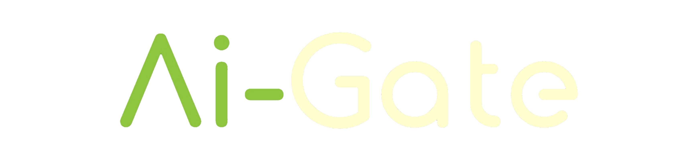
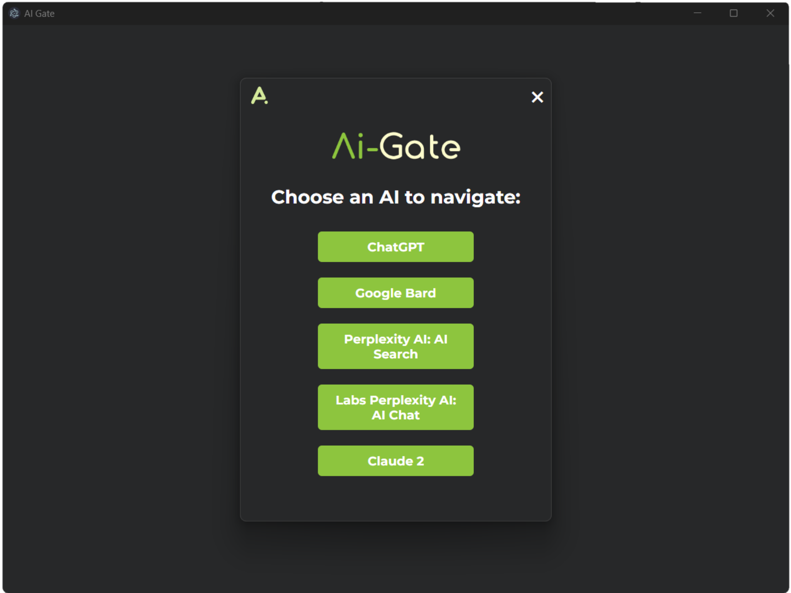
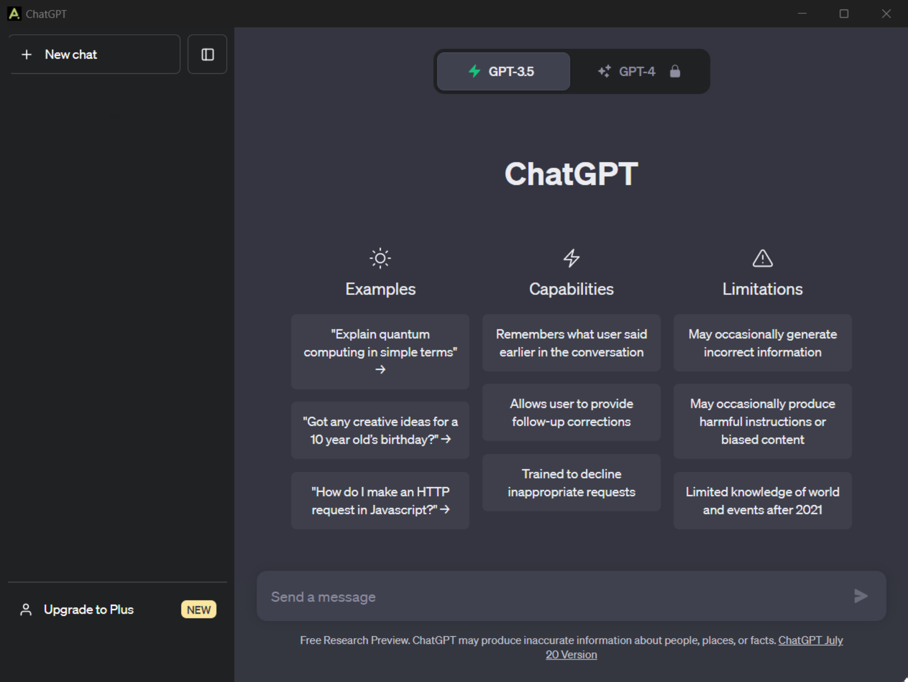
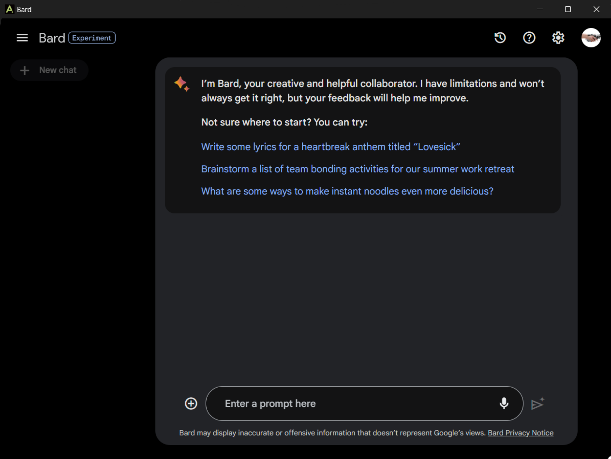
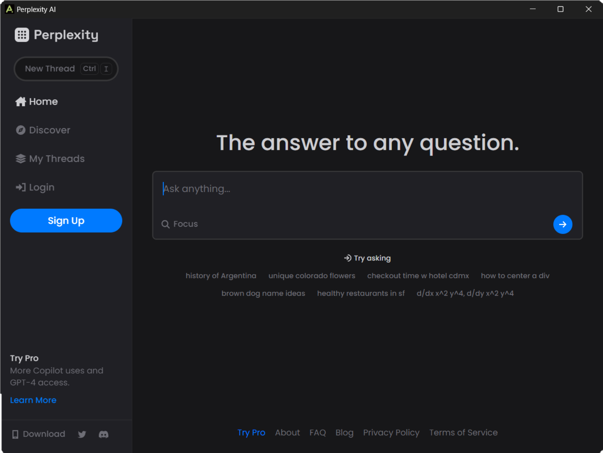
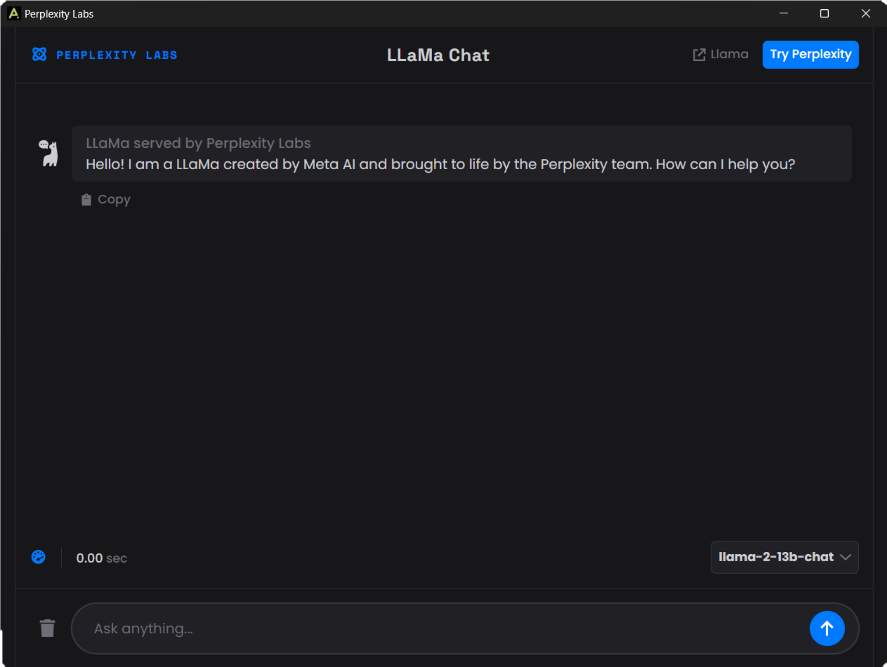

  
  <noscript>
    
🚀 AI Gate 🖥️

  </noscript>

---

🚀 AI Gate is a powerful desktop application that brings together a collection of top AI tools for your convenience. With AI Gate, you can access a variety of AI-powered functionalities, including Chat GPT and more, all from one easy-to-use app. 🖥️

  

## Features

- **AI Tool Collection:** Access a curated selection of cutting-edge AI tools in one place.
- **User-Friendly Interface:** Intuitive and visually appealing interface for seamless interactions.
- **Fast and Efficient:** Instantly harness the power of AI without any delays or complications.
- **Cross-Platform Compatibility:** Available for Windows, macOS, and Linux operating systems.
- **Free and Open-Source:** AI Gate is free to use and open-source, so you can contribute to its development. 🌐

## 📦Releases

    

## Screenshots

| ChatGPT                                       | Google Bard                                  |
|:---------------------------------------------:|:--------------------------------------------:|
|  |  |
&nbsp;

| Perplexity                                    | Claude2                                       |
|:--------------------------------------------:|:--------------------------------------------:|
|  |  |

## How to Use

1. **Download and Install:**
   - Download the AI Gate installer for your operating system (Windows, macOS, or Linux).
   - Run the installer and follow the on-screen instructions to install AI Gate.

2. **Launch the App:**
   - Once installed, launch the AI Gate app from your desktop or application menu.

3. **Explore AI Tools:**
   - Browse through the collection of AI tools available in the app.
   - Click on any tool to access its functionality.

4. **Enjoy AI Power:**
   - Experience the capabilities of various AI tools at your fingertips.

## Contributing

We welcome contributions to make AI Gate even better! If you have any ideas, bug reports, or feature requests, please feel free to create an issue or submit a pull request in the [GitHub repository](https://github.com/inulute/ai-gate).

## 📢 Feedback and Contributions

We warmly welcome your feedback and contributions to improve the AI Gate. If you encounter any issues or have ideas for enhancements, please submit them through GitHub issues or create a pull request. 😊

<h2>
    👨‍💻 Author
</h2>

## License

AI Gate is released under the MIT License.

  

## Acknowledgments

We would like to extend our gratitude to the open-source community and the creators of the AI tools integrated into AI Gate. Their contributions have made this project possible.

Thank you for using AI Gate! We hope you find it a valuable tool for your AI-powered tasks. If you have any questions or need assistance, don't hesitate to reach out. Happy AI exploration! 🤖💡

---