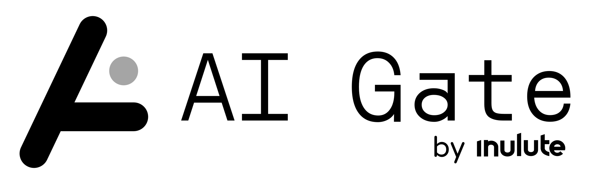
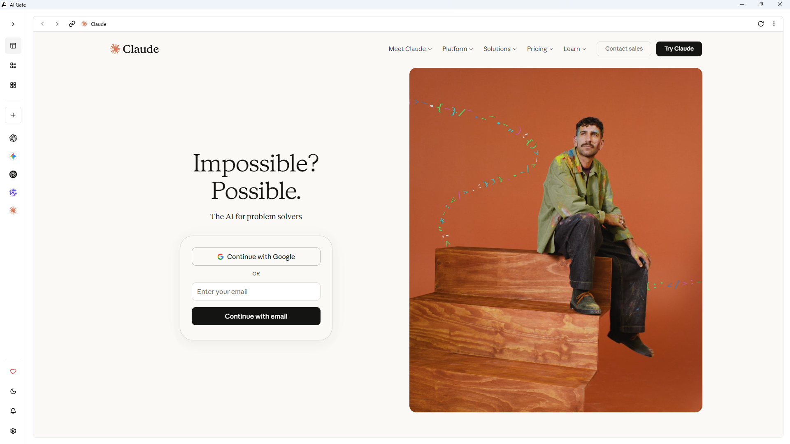
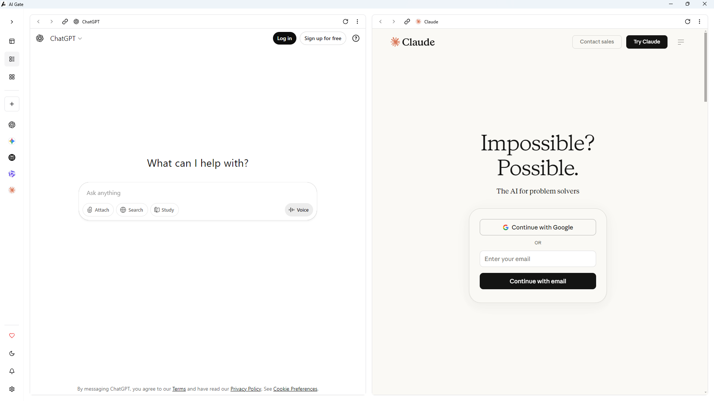
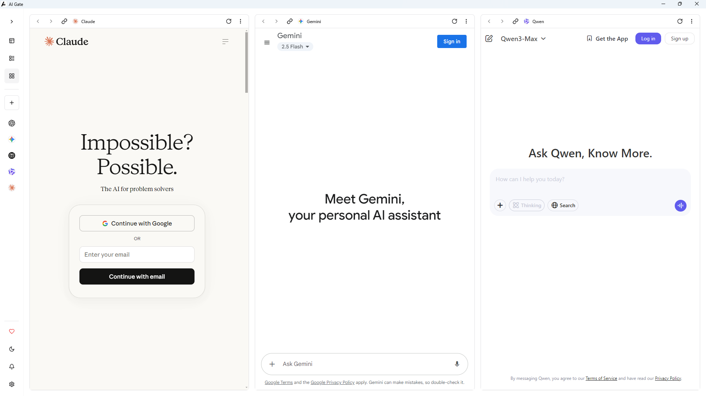

<div align="center">



---

### All your AI tools. One beautiful app.

**ChatGPT • Claude • Gemini • Perplexity • Qwen • Grok**

<br/>

[](https://aigate.inulute.com)

[](https://aigate.inulute.com/download)

<br/>

[Download](#-download) • [Features](#️-features) • [Development](#-development) • [Support](#️-support)

</div>

---

## 🎉 What's New in v4.6.0

<table>
<tr>
<td width="50%">

### 🖥️ Hardened Wayland Support
Fixed black window on launch — Electron now uses `ozone-platform-hint=auto` so it picks native Wayland or XWayland based on what your GPU supports. Auto-detects `WAYLAND_DISPLAY`, `XDG_SESSION_TYPE`, `NIXOS_OZONE_WL`, and the modern `ELECTRON_OZONE_PLATFORM_HINT`.

### ⌨️ Customizable Keyboard Shortcuts
Full shortcut system with Standard and Prefix (tmux-style) modes. Three built-in presets: Original, iTerm, and tmux. Record custom shortcuts live with conflict detection.

### 🔍 Browser Zoom & Tab Numbers
Zoom in/out/reset inside any provider webview (`Ctrl/Cmd +/-/0`). Tab numbers in the bar for quick keyboard targeting.

</td>
<td width="50%">

### 🚀 Global Webview Pool
Switching layouts preserves all webview state — no reloads, no flashing. URLs, scroll position, and sessions stay intact.

### 🪟 Multi-Panel Workspace
View up to 3 AI tools simultaneously with synced or separate tab modes.

### 🛠️ Stability Fixes
Fixed Vite dev-server ELOOP crash, ELECTRON_ARGS feature-flag parser, and duplicate `--enable-features` switch collision.

</td>
</tr>
</table>

### Smart Tab Management

- **Synced tabs mode**: All panels show the same tab bar — click any tab to switch
- **Separate tabs mode**: Each panel has independent tab management
- **Persistent state**: Switching layouts preserves URLs, scroll position, session state
- **Hidden panel memory**: Your active tool in hidden panels is remembered when expanding layout
- **Browser-like behavior**: Switch between tools without reloading — everything preserved

### Quality of Life

- **Smart startup**: Hidden only on autostart; manual launches show the app immediately
- **System tray**: Minimize to tray and restore with a single click
- **Clear notifications**: Know exactly what's happening with informative toasts
- **Auto updates**: Seamless updates delivered through GitHub releases

---

## ✨ Features

<table>
<tr>
<td>

🧰 **Unified AI Access**  
All major AI assistants in one place

🪟 **Multi-Window Layouts**  
Side-by-side comparison and workflows

⚡ **Lightning Fast**  
Vite-powered React on Electron

⌨️ **Keyboard Shortcuts**  
Fully customizable, tmux-style prefix support

</td>
<td>

🖥️ **Cross-Platform**  
Windows, macOS, Linux — native Wayland included

🔄 **Auto Updates**  
Always up-to-date automatically

🔒 **Privacy First**  
No telemetry. No trackers. Period.

📦 **Flatpak / Flathub**  
Sandboxed install coming to Flathub

</td>
</tr>
</table>

---

## 📦 Download

<div align="center">

### Choose Your Platform

<table>
<tr>
<th>Platform</th>
<th>Download</th>
<th>Details</th>
</tr>
<tr>
<td><strong>Windows</strong></td>
<td>
<a href="https://aigate.inulute.com/download">

</a>
</td>
<td>x64 + ARM64 installer</td>
</tr>
<tr>
<td><strong>macOS</strong></td>
<td>
<a href="https://aigate.inulute.com/download">

</a>
</td>
<td>Universal (Intel + Apple Silicon)</td>
</tr>
<tr>
<td><strong>Linux</strong></td>
<td>
<a href="https://aigate.inulute.com/download">

</a>
</td>
<td>AppImage · deb · zip</td>
</tr>
<tr>
<td><strong>Flatpak</strong></td>
<td>

</td>
<td>Submission in progress</td>
</tr>
</table>

</div>

---

## 🚀 Development

### Quick Start

```bash
# Clone the repository
git clone https://github.com/inulute/ai-gate.git
cd ai-gate

# Install dependencies
npm install

# Start development server (web only)
npm run dev

# Start Electron app (full desktop)
npm run electron:dev
```

### Available Scripts

| Command | Description |
|---------|-------------|
| `npm run dev` | Start Vite dev server (web preview) |
| `npm run build` | Build production web assets |
| `npm run electron:dev` | Run Electron in development mode |
| `npm run electron:build` | Build & package production installers |
| `npm run e2e` | Run local Electron shortcut E2E tests |
| `npm run package-win` | Package for Windows only |
| `npm run package-mac` | Package for macOS only |
| `npm run package-linux` | Package for Linux only |
| `npm run lint` | Run ESLint |
| `npm run preview` | Preview production build |


---

## 🖼️ Screenshots

<div align="center">

### Home Screen


### Multi-Panel Layouts
<table>
<tr>
<td align="center" width="50%">

<br/>
<sub>2 Panels</sub>
</td>
<td align="center" width="50%">

<br/>
<sub>3 Panels</sub>
</td>
</tr>
</table>

</div>

---

## 🤝 Contributing

We welcome contributions! Here's how to get started:

1. **Fork** the repository
2. **Create** a feature branch: `git checkout -b feature/amazing-feature`
3. **Commit** your changes: `git commit -m 'Add amazing feature'`
4. **Push** to the branch: `git push origin feature/amazing-feature`
5. **Open** a Pull Request

### Contribution Guidelines

- Ensure `npm run lint` passes before submitting
- Add screenshots for UI changes
- Write clear commit messages
- Update documentation as needed

---

## 📢 Support & Community

<div align="center">

### Need Help?

[](https://github.com/inulute/ai-gate/issues)
[](https://github.com/inulute/ai-gate/discussions)

**Found a bug?** [Open an issue](https://github.com/inulute/ai-gate/issues/new)  
**Have a question?** [Start a discussion](https://github.com/inulute/ai-gate/discussions)  
**Want a feature?** [Request it here](https://github.com/inulute/ai-gate/issues/new?labels=enhancement)

</div>

---

## ❤️ Support

If AI Gate makes your workflow better, consider supporting its development:

<div align="center">

[](https://support.inulute.com)

</div>

**Your support helps us:**
- Maintain and improve AI Gate
- Add new features and AI tools
- Keep the app free and open source
- Provide timely updates and bug fixes

---

## 📄 License

This project is licensed under **GPL-3.0-only** — see [LICENSE](./LICENSE) for details.


---

<div align="center">

**Made with ❤️ by [inulute](https://github.com/inulute)**

[Website](https://aigate.inulute.com) • [GitHub](https://github.com/inulute) • [Support](https://support.inulute.com)

⭐ Star us on GitHub — it helps!

</div>
