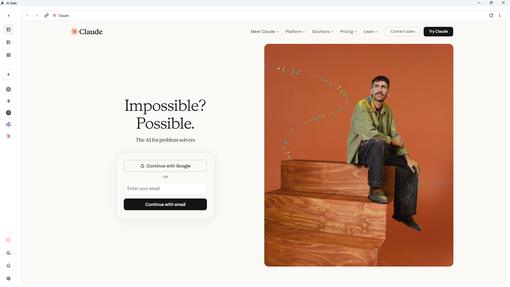
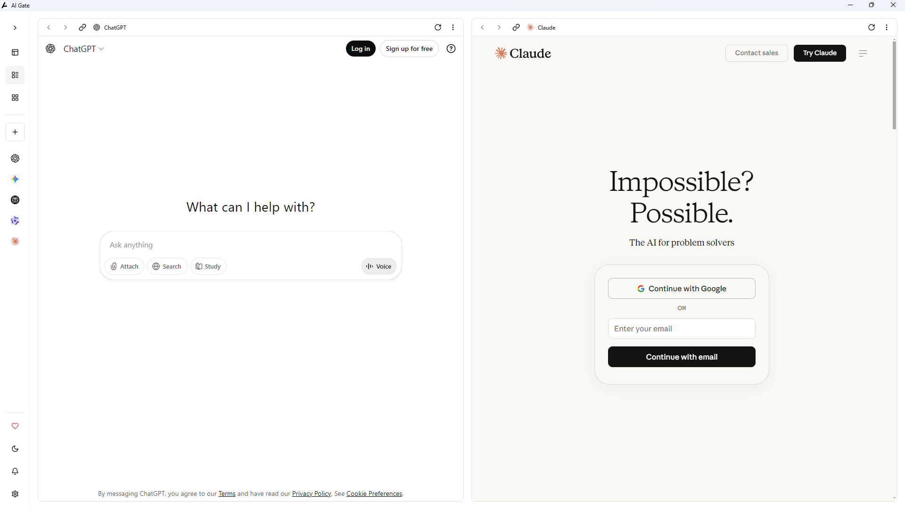
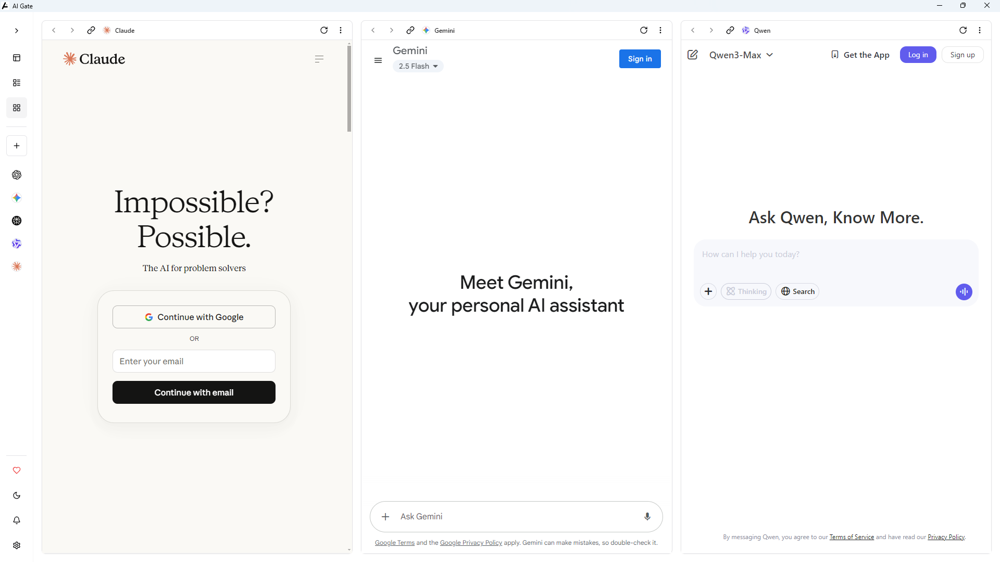

<div align="center">


[](https://github.com/inulute/ai-gate/releases/latest)

</div>

# AI Gate — Release Notes

> All your AI tools. One beautiful app.

**Release:** v4.0.2  •  Date: 2025-10-06

---

## 🎉 Highlights

<small>

**🎨 Redesigned Interface**  
Clean, modern UI that's faster to navigate and easier on the eyes

**🪟 Flexible Layouts**  
Switch between 1, 2, or 3 panels instantly — work your way

**📌 Persistent Tabs**  
Your tools and their state stay exactly where you left them

**⌨️ Power Shortcuts**  
Control everything from your keyboard — layouts, tabs, navigation

**🛠️ Customizable Tools**  
Add, remove, or edit any AI tool in your workspace

**⚙️ Enhanced Settings**  
Full redesign with better organization and intuitive controls

</small>

---

## 🧭 Smart Tab Management

- **Single panel mode**: Keep your current tool, expand seamlessly when needed
- **Persistent ordering**: No random shuffles — your layout stays predictable
- **Intelligent closing**: Shrinking layouts closes rightmost tabs first, keeping your primary visible
- **Browser-like behavior**: Switch between tools without reloading — everything preserved

---

## ✨ Features

- 🧰 Unified AI Access — All major AI assistants in one place
- 🪟 Multi-Window Layouts — Side-by-side comparison and workflows
- ⚡ Lightning Fast — Vite-powered React on Electron
- 🖥️ Cross-Platform — Windows, macOS, and Linux
- 🔄 Auto Updates — Always up-to-date automatically
- 🔒 Privacy First — No telemetry. No trackers. Period.

---

## 📦 Downloads

<div align="center">

### Get the latest release

[](https://github.com/inulute/ai-gate/releases/latest)

</div>

### Platform builds

| Platform | Download | Details |
|---|---:|---|
| Windows | [](https://aigate.inulute.com/download) | x64 + ARM64 installer |
| macOS | [](https://aigate.inulute.com/download) | Universal (Intel + Apple Silicon) |
| Linux | [](https://aigate.inulute.com/download) | AppImage |

> Tip: Official release assets (installers / AppImage / dmg) are published on the GitHub Releases page linked above.

---

## 🚀 Development & Build

For contributors or advanced users who want to build locally, follow the steps in the repository (same as the README):

```bash
# Clone the repository
git clone https://github.com/inulute/ai-gate.git
cd ai-gate

# Install dependencies
npm install

# Start development server (web only)
npm run dev

# Start Electron app (full desktop)
npm run electron:dev
```

---

## 🖼️ Screenshots






---

## 📢 Support & Changelog

- Issues: https://github.com/inulute/ai-gate/issues
- Discussions: https://github.com/inulute/ai-gate/discussions
- Full changelog and release assets: https://github.com/inulute/ai-gate/releases

---

## 📄 License

This project is licensed under GPL-3.0-only — see [LICENSE](./LICENSE) for details.

---

<div align="center">

**Made with ❤️ by [inulute](https://github.com/inulute)**

</div>
